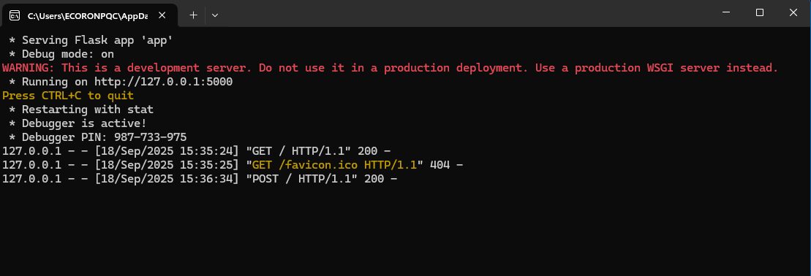

# Pega Log Viewer

The Pega Log Viewer was developed to address the need for a structured and user-friendly visualization of Pega Tracer XML exports. This lightweight web application, built using Python, HTML, and CSS (leveraging the Bootstrap framework), provides a set of features designed to enhance log analysis efficiency:
## Key Features

-  **Tabular rendering of Pega-generated XML log files**  
-  **Advanced filtering capabilities to isolate relevant log entries**  
-  **GoToLine functionality for quick navigation to specific log lines**  
-  **Expandable tree view for detailed inspection of each log entry**  
-  **Automatic highlighting of Failures and Exceptions**  
-  **Aggregation and grouping by ActivityName**  

To launch the application, execute the Python script:  
> python python.py

This will start the local development server and make the application accessible at:
> http://127.0.0.1:5000/

  

After launch the application, you can start to use it by uploading the xml file
-  Use the "UploadFile" button to load a Pega Tracer XML file. The application includes error handling for Invalid file formats and Corrupted or unreadable files  
  

-  General log view with structured rows #1  

-  General log view with structured rows #2  
  

-  Expandable details for each log entry #1  
  

-  Expandable details for each log entry #2  
  

-  Error and exception highlighting
  

-  Filtering interface  
  

