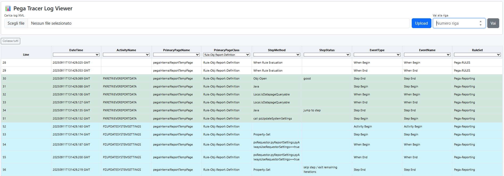

# Pega Log Viewer

Il logViewer lasce dall'esigenza di visualizzare correttamente ed in forma tabellare gli export del tracer Pega.
La web application creata in python, html e css (con l'utilizzo della libreria bootstrap) permette di:
- **Caricare il file xml generato da Pega in forma tabellare**
- **Filtrare i risultati**
- **Funzionalità goToLine**
- **Dettagli di ogni riga organizzati come albero espandibile**
- **Identificazione rapida dei Fail/Exception**
- **Aggregazione sulla base di ActivityName**

Lanciare lo script python python.py per far partire il server e rendere disponibile l'applicazione
sulla url locale http://127.0.0.1:5000/

  

Caricare il file xml tramite il bottone "UploadFile". L'applicazione gestisce errori in caso di formato non corretto oppure
di file corrotto

  

Dettagli di visualizzazione dei log #1
  

Dettagli di visualizzazione dei log #2
  

Dettagli espandibili
  

  

Visualizzazione Errori
  

Filtri  
  

